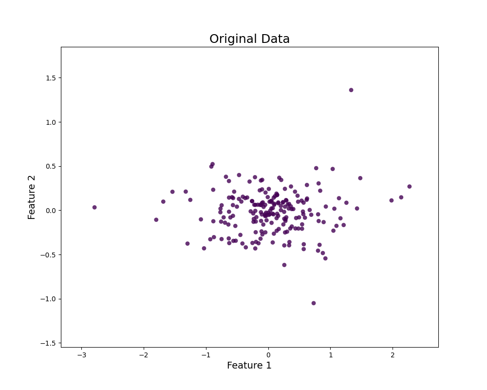

# SParseSampler (SPS)

[](https://badge.fury.io/py/sparsesampler)
[](https://opensource.org/licenses/MIT)

SParseSampler (SPS) is a Python package for efficient subsampling of large-scale single-cell RNA-seq and flow cytometry datasets while preserving rare cell populations. The method employs an unsupervised approach that maintains dataset structure and rare cell types without requiring explicit labels.

## Key Features

### Core Method
- PCA-based dimensionality reduction for initial data processing
- Variance-weighted binning in the reduced dimensional space
- Iterative cell selection prioritizing sparsest bins
- Preserves rare populations without requiring cell type labels

### Performance Benefits
- Computational efficiency comparable to random sampling
- Superior rare cell retention compared to existing methods (Hopper, Atomic Sketch)
- Performance comparable to scSampler with improved speed
- Successfully tested on datasets up to 34 million cells

## Installation

```bash
pip install sparsesampler
```

## Technical Details

### Parameters
- **Number of Principal Components (p)**
  - Recommended range: 20-100
  - Controls dimensionality reduction level

- **Bin Resolution Factor (K)**
  - Recommended range: 50-200
  - Affects sampling granularity

### Supported Data Types
- Single-cell RNA sequencing data
- Flow cytometry data

## Validation

### Benchmarking
- Comprehensive comparison against state-of-the-art methods
- Validated on large-scale datasets:
  - MCC dataset (scRNA-seq): 3.2M cells
  - LCMV dataset (flow cytometry): 34M cells
- Consistent performance across varying dataset sizes

## Usage

```python
import sparsesampler as sps
import pandas as pd
import numpy as np
from scipy import sparse

# Load your data (n_samples × n_features)
# Example 1: From CSV file
X = pd.read_csv('your_data.csv').values

# Example 2: From NumPy array
X = np.load('your_data.npy')

# Example 3: From sparse matrix
X = sparse.load_npz('your_sparse_data.npz')

# Example 4: scRNA-seq data (AnnData format)
import scanpy as sc
adata = sc.read_h5ad('your_data.h5ad')
X = adata.X  # Use .toarray() if sparse matrix

# Initialize and run SParseSampler
sampler = sps.SParseSampler(n_pc=50, k_factor=100)
indices = sampler.fit_transform(X)

# Get subsampled data
X_sampled = X[indices]
```

# Sparse Sampler Visualization

This project demonstrates a step-by-step sparse sampling process using toy data and PCA binning.

## Animated Sampling Process

The following animation shows how points are selected from a 2D toy dataset using PCA binning. Points are selected category by category (cells with 1 point, 2 points, etc.), and the process is visualized step by step:

- All points start as skyblue.
- When a category is considered, the cells are highlighted in yellow and the points in those cells are shown in gray for visibility.
- Selected points turn red and remain red in all subsequent frames.
- The process continues until the target number of points is reached.



## Usage

To generate the animation, run:

```bash
python -m sparsesampler.visualization
```

The animation will be saved as `sampling_process.gif` in the project directory.

## Citation

If you use SParseSampler in your research, please cite:

```bibtex
# Add citation when available
```

## License

This project is licensed under the MIT License - see the [LICENSE](LICENSE) file for details.

## Contributing

Contributions are welcome! Please feel free to submit a Pull Request.
